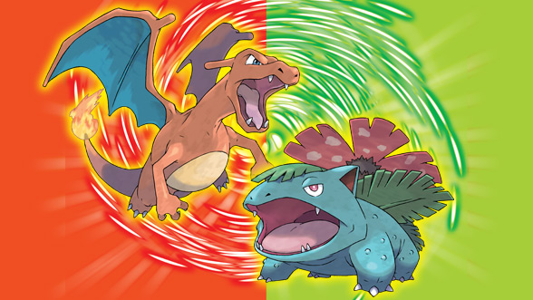

  

## Master Codes

A **Master Code** is a special type of cheat code used in conjunction with Action Replay or other cheat devices. It acts as an enabler for other cheat codes to work correctly. Often required for more complex cheats, it ensures the device is activated and that additional codes (like item modifiers, infinite health, etc.) will function properly. The Master Code is usually entered first and remains active while other codes are used in conjunction. Without the Master Code, some cheats may fail to work or cause errors in gameplay.

| Pokemon Fire Red(US)                       | Pokemon Leaf Green(US)                     |
| ------------------------------------------ | ------------------------------------------ |
| `72BC6DFB E9CA5465` `A47FB2DC 1AF3CA86` | `72BC6DFB E9CA5465` `56671F3A 6F4F4D6B` |

| Pokemon Fire Red(JP)                       | Pokemon Leaf Green(JP)                     |
| ------------------------------------------ | ------------------------------------------ |
| `8FA79C07 CABE13C8` `F0826040 FE465C57` | `8FA79C07 CABE13C8` `2FD2DBC6 552BC912` |

They work with the codes here - but they might not work with codes
you find elsewhere. We know that's a shame but there is currently not a solution.

---

## Pokemon Encounter Codes.

### Master Encounter Code

The Master Encounter Code will be the first line of the two line code block to encounter wild Pokemon of your choice. These codes are Game and Region Specific. Below are the Master Encounter Codes for Fire Red and Leaf Green for the US and Japan.

US:

| Fire Red(US)        | Leaf Green(US)      |
| ------------------- | ------------------- |
| `17543C48 E65E0B97` | `594F7021 3B4E81A7` |

Japanese:

| Fire Red(JP)        | Leaf Green(JP)      |
| ------------------- | ------------------- |
| `8ED19163 3579E69D` | `337BE38E E583889C` |

So if you want a Bulbasaur in Leaf Green (JP) use:
`337BE38E E583889C` ⬅️ Leaf Green (JP) code
`AD86124F 2823D8DA` ⬅️ Bulbasaur code

==NOTE:== **The following codes have only been spot tested. Please reach out of some codes don't work.**

---

### Generation 1 Pokemon
| Pokemon          | Code                 | Pokemon          | Code                |
| ---------------- | -------------------- | ---------------- | ------------------- |
| 1 - Bulbasaur    | `AD86124F 2823D8DA`  | 2 - Ivysaur      | `AB84463B B2609644` |
| 3 - Venusaur     | `3542F0A7 7D2E171F`  | 4 - Charmander   | `DB8C60CD 81FD6AA7` |
| 5 - Charmeleon   | `08506D61 55CBD9A8`  | 6 - Charizard    | `A56395D2 8AF46857` |
| 7 - Squirtle     | `BCDC8C406 2F2FD763` | 8 - Wartortle    | `268349C8 63FF53CE` |
| 9 - Blastoise    | `5FD24ABC 1FE3296A`  | 10 - Caterpie    | `358CC2BF 9BFA3518` |
| 11 - Metapod     | `DC725D4E 3A20792F`  | 12 - Butterfree  | `33EFFB7C E1794F5B` |
| 13 - Weedle      | `9A86D92A 635F8DBC`  | 14 - Kakuna      | `CCEC9F6E 5A2A0F12` |
| 15 - Beedrill    | `F3D99280 49F4EEDC`  | 16 - Pidgey      | `139BBA32 2DC356C8` |
| 17 - Pidgeotto   | `2F7B0F2F 257173EA`  | 18 - Pidgeot     | `13659B39 95BD80E5` |
| 19 - Rattata     | `E5C49E22 47B157F2`  | 20 - Raticate    | `60C9DC15 1AD9B226` |
| 21 - Spearow     | `2F5D7856 A5F7B4AE`  | 22 - Fearow      | `23689847 DA918B8D` |
| 23 - Ekans       | `A5BA4CFA CA5D771C`  | 24 - Arbok       | `B75D69F0 7C3B3103` |
| 25 - Pikachu     | `9D4A1BFF 05120D39`  | 26 - Raichu      | `CE7B779B AE493550` |
| 27 - Sandshrew   | `7DFC4CBD 20BB83B6`  | 28 - Sandslash   | `CFC711B9 0585971F` |
| 29 - Nidoran(F)  | `B6450111 C65005BC`  | 30 - Nidorina    | `0BA329E0 CEB39484` |
| 31 - Nidoqueen   | `C3B010F5 6DB0ED0E`  | 32 - Nidoran(M)  | `A38262A2 825F8CF0` |
| 33 - Nidorino    | `33D5E08A 037AB9C4`  | 34 - Nidoking    | `82E3DD4B EBFEF864` |
| 35 - Clefairy    | `E8EAB84F 26C8AB6B`  | 36 - Clefable    | `D15755D8 AF5BE6F1` |
| 37 - Vulpix      | `276AF592 A3A635CC`  | 38 - Ninetales   | `27B815E0 B8CCC2DA` |
| 39 - Jigglypuff  | `B18AC7E0 E667A184`  | 40 - Wigglytuff  | `7CEDC4CF F95C5521` |
| 41 - Zubat       | `47596727 51BB292A`  | 42 - Golbat      | `FF3A0DD1 DF54EB13` |
| 43 - Oddish      | `EF723724 F31E5F64`  | 44 - Gloom       | `A386B043 9DEB5064` |
| 45 - Vileplume   | `4A2748A4 F888F1C9`  | 46 - Paras       | `EAD30258 3988D84F` |
| 47 - Parasect    | `74CFC9E9 82CD278E`  | 48 - Venonat     | `0CC56D24 C9F5A33A` |
| 49 - Venomoth    | `DFDFFF0A 8919BB28`  | 50 - Diglett     | `BA7199EC 664F9418` |
| 51 - Dugtrio     | `BCC0FB44 1A047D3C`  | 52 - Meowth      | `5F38FD3F 5D7412A3` |
| 53 - Persian     | `0BEC25D3 787468AE`  | 54 - Psyduck     | `70CEC019 12F0A7B0` |
| 55 - Golduck     | `32E8BC37 7712CF08`  | 56 - Mankey      | `DAAB0C35 55611812` |
| 57 - Primeape    | `B82FBCB6 C954F4ED`  | 58 - Growlithe   | `CD7047AB 42D861F2` |
| 59 - Arcanine    | `3099D33C 49E66A04`  | 60 - Poliwag     | `AF0908F3 650FE1BD` |
| 61 - Poliwhirl   | `C29C3277 063E67E9`  | 62 - Poliwrath   | `8DC834CF BFECCA56` |
| 63 - Abra        | `5738CFE5 515C61CF`  | 64 - Kadabra     | `67CA1286 0E3A5D83` |
| 65 - Alakazam    | `C91954D9 68AAD246`  | 66 - Machop      | `8AD2C8BB EB3D7A39` |
| 67 - Machoke     | `95EFD5EA DD857E98`  | 68 - Machamp     | `3BF5B7C4 061AAA45` |
| 69 - Bellsprout  | `CF2E3B09 3B30426E`  | 70 - Weepinbell  | `0030C455 4F43BB12` |
| 71 - Victreebel  | `1DF3B8CA DC70EC58`  | 72 - Tentacool   | `65C4E9C5 24CA1894` |
| 73 - Tentacruel  | `51DDE51A 00DE2CE3`  | 74 - Geodude     | `399F7170 D519951E` |
| 75 - Graveler    | `DDF655E3 9BDEE49C`  | 76 - Golem       | `103F567C 2F1A9043` |
| 77 - Ponyta      | `877A6953 8F6209F2`  | 78 - Rapidash    | `195BAD3F C840CA28` |
| 79 - Slowpoke    | `4CEC5478 ACBC593C`  | 80 - Slowbro     | `FE7C44DB 7672B1D8` |
| 81 - Magnemite   | `3C17AEA9 5DC9D705`  | 82 - Magneton    | `B8BD13C5 E3E7D9B3` |
| 83 - Farfetch'd  | `9121060C 74B908E0`  | 84 - Doduo       | `920BE3C7 3E00359C` |
| 85 - Dodrio      | `02258041 19ABFE29`  | 86 - Seel        | `8EC19A12 FD47B55F` |
| 87 - Dewgong     | `E18D1069 1053E30C`  | 88 - Grimer      | `EB7F9C3F DB3192F5` |
| 89 - Muk         | `729160A9 F8F73577`  | 90 - Shellder    | `92A2030E 24F19E86` |
| 91 - Cloyster    | `FB078533 1A99C72A`  | 92 - Gastly      | `99B8A848 91759EFF` |
| 93 - Haunter     | `7F14537B 6C00E975`  | 94 - Gengar      | `BA9A9758 4221EBF4` |
| 95 - Onix        | `54D9A0DB 68FC768F`  | 96 - Drowzee     | `C5C4BBBB 55B1B77F` |
| 97 - Hypno       | `F4BB6321 8E9265DB`  | 98 - Krabby      | `D83FACC2 7D31E557` |
| 99 - Kingler     | `FF0F431F 400EF220`  | 100 - Voltorb    | `ABD2C0C0 FBC68A93` |
| 101 - Electrode  | `0C2333CD 141730A7`  | 102 - Exeggcute  | `8D2F9E72 8719250B` |
| 103 - Exeggutor  | `744AF614 12D8281B`  | 104 - Cubone     | `D9E3884F 37500E3F` |
| 105 - Marowak    | `CB4A8BD1 1D028DA2`  | 106 - Hitmonlee  | `9EDB950D 454533E5` |
| 107 - Hitmonchan | `3535FA3A EBECD355`  | 108 - Lickitung  | `F582757C 16122B78` |
| 109 - Koffing    | `BF93F87F BC1AB791`  | 110 - Weezing    | `D966DA15 88BBB73A` |
| 111 - Rhyhorn    | `7DA9C8C7 8549C3D4`  | 112 - Rhydon     | `9071D41E 55259C19` |
| 113 - Chansey    | `AD38C4DB B5EBB8A7`  | 114 - Tangela    | `100D1518 466A2D06` |
| 115 - Kangaskhan | `8F4BE409 7110788B`  | 116 - Horsea     | `02401CFF F2742052` |
| 117 - Seadra     | `B0160E28 ED6B68EC`  | 118 - Goldeen    | `29061002 69BB68FF` |
| 119 - Seaking    | `676505B9 904C9DE3`  | 120 - Staryu     | `D7D9A00C 7BFB7AAC` |
| 121 - Starmie    | `0E2752FA 51091446`  | 122 - Mr.Mime    | `0922D9A2 C1E680BA` |
| 123 - Scyther    | `28BEFBB3 68DE4569`  | 124 - Jynx       | `FB0FC84E D45216CF` |
| 125 - Electabuzz | `1E6DE7CB DDDBAD78`  | 126 - Magmar     | `C644F8D1 4159A2D6` |
| 127 - Pinsir     | `AEFBB853 03F4B721`  | 128 - Tauros     | `1D5557F2 FACC2BA7` |
| 129 - Magikarp   | `04658924 E67574E2`  | 130 - Gyarados   | `56156F0A D2F071F2` |
| 131 - Lapras     | `483AC796 E3850B8F`  | 132 - Ditto      | `3613AA25 2CC1B172` |
| 133 - Eevee      | `4B78A144 F02E1187`  | 134 - Vaporeon   | `D82AEDF5 F23B27A4` |
| 135 - Jolteon    | `1850F0B1 AAFB142F`  | 136 - Flareon    | `AB622741 B3F84F8B` |
| 137 - Porygon    | `6EE60CB5 746DFF03`  | 138 - Omanyte    | `1DBD6215 4FD65295` |
| 139 - Omastar    | `23F20EC6 1368F543`  | 140 - Kabuto     | `32A2B3E0 40DB80D9` |
| 141 - Kabutops   | `2058318E 392B7EE5`  | 142 - Aerodactyl | `C44B6463 DB3237C3` |
| 143 - Snorlax    | `E9ADF485 15BE8FA7`  | 144 - Articuno   | `D7B594AF C1DA18AB` |
| 145 - Zapdos     | `83E25054 9C927E5E`  | 146 - Moltres    | `F8DEC3CC A014B094` |
| 147 - Dratini    | `47C69D5D 1AA59D6D`  | 148 - Dragonair  | `8B3A1FF0 A3C0E786` |
| 149 - Dragonite  | `796E6824 2B208DD5`  | 150 - Mewtwo     | `4C77BA3F CA4EDCB6` |
| 151 - Mew        | `B751BDF4 95CEF4CC`  |                  |                     |

==NOTE:== Mew will not obey if caught in the wild (without an event)
You can still catch it with a Masterball and get a Pokedex
entry. To get an obeying Mew use the Mew in Box 1 Slot 1
Code.

---

### Generation II Pokemon

| Pokemon          | Code                | Pokemon          | Code                |
| ---------------- | ------------------- | ---------------- | ------------------- |
| 152 - Chikorita  | `539C7E13 DD795F72` | 153 - Bayleef    | `39D823E3 9EB6C9AA` |
| 154 - Meganium   | `A2F7F837 7F974DEB` | 155 - Cyndaquil  | `E4995046 3D00BF91` |
| 156 - Quilava    | `B9CCC7BB D4C29E22` | 157 - Typhlosion | `B5592578 FBB9A4ED` |
| 158 - Totodile   | `6699EF70 D7B03D43` | 159 - Croconaw   | `33C5C90B D46AD9DC` |
| 160 - Feraligatr | `E1F0FEFA D0036CD4` | 161 - Sentret    | `6C2D5D5E 008A751F` |
| 162 - Furret     | `2B34A3C7 A829209F` | 163 - Hoothoot   | `B33DAC5B 29EB7EB5` |
| 164 - Noctowl    | `8E0B9473 A4AE2B53` | 165 - Ledyba     | `5F2FD32D 941693B4` |
| 166 - Ledian     | `1CD7078F A7384A34` | 167 - Spinarak   | `BF975E40 430B4806` |
| 168 - Ariados    | `F3D55605 74AE5C52` | 169 - Crobat     | `56FC2792 3AEFE3F9` |
| 170 - Chinchou   | `D70D1018 A021245F` | 171 - Lanturn    | `2D2CC458 21BDD10C` |
| 172 - Pichu      | `90AECEE5 A888F8AE` | 173 - Cleffa     | `08C2447D 2096B6AE` |
| 174 - Igglybuff  | `D7F35EE0 D224ECDE` | 175 - Togepi     | `82269FC8 9579FD5A` |
| 176 - Togetic    | `E3581C9B AE652F9A` | 177 - Natu       | `B635603F B1E81481` |
| 178 - Xatu       | `459823AE 3F1683A4` | 179 - Mareep     | `0783E965 C5165BF8` |
| 180 - Flaaffy    | `F510A285 5288E291` | 181 - Ampharos   | `3CE54322 74A86618` |
| 182 - Bellossom  | `F0088391 0C65D5E3` | 183 - Marill     | `51EB125F EAA0FCBE` |
| 184 - Azumarill  | `E832EF37 64D0E6A2` | 185 - Sudowoodo  | `DDA1AC43 4A067FAE` |
| 186 - Politoed   | `5C6CD179 E18C31EF` | 187 - Hoppip     | `B1BC8307 69EF9C2C` |
| 188 - Skiploom   | `E32EA0FE CB37FF3B` | 189 - Jumpluff   | `C03FCFEF 84CB37BA` |
| 190 - Aipom      | `A45DFE4F F27A9D8D` | 191 - Sunkern    | `165C689B AF94A177` |
| 192 - Sunflora   | `36838BE7 E5367C3A` | 193 - Yanma      | `E500846E 9A4FF5C7` |
| 194 - Wooper     | `6F071CA9 63FF4902` | 195 - Quagsire   | `67375392 E7F55C24` |
| 196 - Espeon     | `EF8A105C 72CEF63E` | 197 - Umbreon    | `EF708FD1 C5E8B000` |
| 198 - Murkrow    | `98F8C8F7 EEA657B9` | 199 - Slowking   | `43D2617C C2F14DFB` |
| 200 - Misdreavus | `2E5E5AEB 22EBF9FF` | 201 - Unown      | `10998FB0 656B5C99` |
| 202 - Wobbuffet  | `EC4EB940 2C63CA65` | 203 - Girafarig  | `41377A90 E36247DE` |
| 204 - Pineco     | `43C3A9BF 477AF067` | 205 - Forretress | `55815067 03B03952` |
| 206 - Dunsparce  | `4F8D48EA 9336834B` | 207 - Gligar     | `729F34AB 5B1018D0` |
| 208 - Steelix    | `1FE62E14 130CD2F8` | 209 - Snubbull   | `77C7197D 502B8B56` |
| 210 - Granbull   | `CF223304 929E964E` | 211 - Qwilfish   | `C9551136 F45B0236` |
| 212 - Scizor     | `F8D4BFAE D2C136F5` | 213 - Shuckle    | `A94D8CB8 560257D4` |
| 214 - Heracross  | `779D6EBF 3139EFF6` | 215 - Sneasel    | `C21BA23A 95AB64BD` |
| 216 - Teddiursa  | `EDEB2FF0 88466B79` | 217 - Ursaring   | `2607FA8F 4BF940FA` |
| 218 - Slugma     | `E2899947 9269834F` | 219 - Magcargo   | `A58E1198 6E004BAD` |
| 220 - Swinub     | `F949DADD BBC8B5CD` | 221 - Piloswine  | `AA68D49C B33C8972` |
| 222 - Corsola    | `DDEFF53A EC57A23F` | 223 - Remoraid   | `A67D580A B44A4DF4` |
| 224 - Octillery  | `78BA5E9D BA836EEB` | 225 - Delibird   | `BC1FE4EC 9F1818A1` |
| 226 - Mantine    | `3AF8DB31 042E9DF9` | 227 - Skarmory   | `92DE3CD4 65C14106` |
| 228 - Houndour   | `CABF0A0B B0E620D3` | 229 - Houndoom   | `D8D99C49 B49D47DC` |
| 230 - Kingdra    | `2B185541 DB13ACF6` | 231 - Phanpy     | `CBCB02D6 C41FE3F4` |
| 232 - Donphan    | `B8A6C516 12ECADE5` | 233 - Porygon2   | `04EA10C3 8DB0146F` |
| 234 - Stantler   | `9C0B5F02 A2857BBC` | 235 - Smeargle   | `49D7E467 103D0D48` |
| 236 - Tyrogue    | `3D2030E2 B2A0CACE` | 237 - Hitmontop  | `A357C435 8BC380D1` |
| 238 - Smoochum   | `8C287F7F E3950A6E` | 239 - Elekid     | `A78E8FFA EDB5DA5C` |
| 240 - Magby      | `D77AEB51 E63292DB` | 241 - Miltank    | `1A55F1D1 2FCDADEA` |
| 242 - Blissey    | `01EA07BF 793C86F2` | 243 - Raikou     | `43FF33D1 F368CDE6` |
| 244 - Entei      | `0C8037A6 BE1D9DB2` | 245 - Suicune    | `80755BDB E392B806` |
| 246 - Larvitar   | `2C8E4296 84D8D6E3` | 247 - Pupitar    | `8418E051 5C53CE38` |
| 248 - Tyranitar  | `32D66B09 40354103` | 249 - Lugia      | `545C676A 51FFDC1C` |
| 250 - Ho-oh      | `437065EF 67DF37EF` | 251 - Celebi     | `4AEC27E8 A5FF1540` |

---

### Generation III Pokemon
#### Gen III Master Encounter Codes

Okay now Codes for the Ruby and Sapphire Pokemon are a bit more complicated,
the codes are the same scheme but longer:

==NOTE:== These codes will only work with real AR V3 if you have
an updated AR/GSA they will NOT WORK)

| Pokemon Fire Red(US)                                              | Pokemon Leaf Green(US)                                            |
| ----------------------------------------------------------------- | ----------------------------------------------------------------- |
| `022EA6CD 594A7718` `D2BF38B5 7E300C38` `8343300B ADEF57CA` | `46E4D9D2 C48C7156` `D2BF38B5 7E300C38` `EA57D52F 1D29C38E` |

| Pokemon Fire Red(JP)                                              | Pokemon Leaf Green(US)                                            |
| ----------------------------------------------------------------- | ----------------------------------------------------------------- |
| `C79B17ED 5164E167` `D2BF38B5 7E300C38` `3004A5CB 9DFC57E4` | `E7B90C81 0B306132` `D2BF38B5 7E300C38` `0C3EA2E5 8E200416` |

---
#### Generation III Pokemon

| Pokemon          | Code                 | Pokemon          | Code                |
| ---------------- | -------------------- | ---------------- | ------------------- |
| 252 - Treecko    | `D9FE5FBF B09F0205`  | 253 - Grovyle    | `1AA369E5 72BBA287` |
| 254 - Sceptile   | `673752FC D4065FA8`  | 255 - Torchic    | `2F22FB72 D5887213` |
| 256 - Combusken  | `136BD0D6 606187D2`  | 257 - Blaziken   | `FCEF6F25 3905588C` |
| 258 - Mudkip     | `A72262EA 7F7FD464`  | 259 - Marshtomp  | `8EED2DB5 964D67F8` |
| 260 - Swampert   | `1A6BE162 4481A843`  | 261 - Poochyena  | `7A1769D1 40699C90` |
| 262 - Mightyena  | `4B9FB849 14A5AA94`  | 263 - Zigzagoon  | `F1F00B1F F5B3721A` |
| 264 - Linoone    | `EF31EC55 1417DEC6`  | 265 - Wurmple    | `A83BF115 130C3917` |
| 266 - Silcoon    | `2244D1D6 A87DAAB7`  | 267 - Beautifly  | `6DBB6131 90E40C0A` |
| 268 - Cascoon    | `AD5C9BC6 8E3E4C3B`  | 269 - Dustox     | `7CC9941A A70E2C37` |
| 270 - Lotad      | `D4BE7AA5 F9CE65B8`  | 271 - Lombre     | `9459FC5B 5516BE48` |
| 272 - Ludicolo   | `809DED68 B67856D4`  | 273 - Seedot     | `DCE40F64 D45D202E` |
| 274 - Nuzleaf    | `BF87B744 16F7C28C`  | 275 - Shiftry    | `3C703413 6B8119CC` |
| 276 - Taillow    | `BBB05E5B 3A3FDC85`  | 277 - Swellow    | `D0B107DB 027BEBD8` |
| 278 - Wingull    | `C963D063 10F5AC28`  | 279 - Pelipper   | `73285D38 A5A4E2BD` |
| 280 - Ralts      | `86C62F1D 27B0AF88`  | 281 - Kirlia     | `1A2EEF24 65E331B7` |
| 282 - Gardevoir  | `7D45FD6B BAABF3CF`  | 283 - Surskit    | `00C9CFD8 65021DD5` |
| 284 - Masquerain | `A14CF5B9 0D7133A1`  | 285 - Shroomish  | `3F140B0A 5937E9BE` |
| 286 - Breloom    | `A32B0FED 60C07CFA`  | 287 - Slakoth    | `485C366A DA423D56` |
| 288 - Vigoroth   | `FEA287AE FFB54BB5`  | 289 - Slaking    | `5D38F9C5 DAA67938` |
| 290 - Nincada    | `43A8378B 9EF75A96`  | 291 - Ninjask    | `22DDE250 8D8EC616` |
| 292 - Shedinja   | `52C2D901 7344A4FA`  | 293 - Whismur    | `FBC2DB33 D8FC5AC6` |
| 294 - Loudred    | `FE9AF7C9 14FDA298`  | 295 - Exploud    | `14182A0A 79282B1B` |
| 296 - Makuhita   | `7B801817 11F090AA`  | 297 - Hariyama   | `4D371C9E 0A2DF533` |
| 298 - Azurill    | `26ADB7EE 91286E09`  | 299 - Nosepass   | `1442906D 473E0C26` |
| 300 - Skitty     | `B4015263 3D8633C6`  | 301 - Delcatty   | `3088742E D89961FA` |
| 302 - Sableye    | `8D571791 584F1676`  | 303 - Mawile     | `5F3C63E3 B673BE5E` |
| 304 - Aron       | `EEC41DEB 3342969F`  | 305 - Lairon     | `79BE0284 FA8BF8A0` |
| 306 - Aggron     | `8388E07F 48E67820`  | 307 - Meditite   | `0E4C4AA5 E7F532D7` |
| 308 - Medicham   | `063E4A1A E5A25573`  | 309 - Electrike  | `3F5C8201 651A6EFD` |
| 310 - Manectric  | `9AA97665 37DD44B1`  | 311 - Plusle     | `B135B018 4F5665D6` |
| 312 - Minun      | `DB37A521 AA84D2C4`  | 313 - Volbeat    | `B86B39BB 97DC88B5` |
| 314 - Illumise   | `F75A3D1C 04A663CF`  | 315 - Roselia    | `23E5A94B D21E7E80` |
| 316 - Gulpin     | `A86C4608 9C15E158`  | 317 - Swalot     | `CA12CA9A 91D29CAF` |
| 318 - Carvanha   | `A9CF954D E9766F71`  | 319 - Sharpedo   | `E684507C B44D6D05` |
| 320 - Wailmer    | `769A7373 7F6C71B8`  | 321 - Wailord    | `47B99235 3CAC8E1F` |
| 322 - Numel      | `AA1264F4 8D3DB4BE`  | 323 - Camerupt   | `5166F096 A0F21E46` |
| 324 - Torkoal    | `42084D1D C19BB889`  | 325 - Spoink     | `BF9B34C2 D768D3A9` |
| 326 - Grumpig    | `7FD8F8C5 BEAD0097`  | 327 - Spinda     | `CDB2A8AF 7D43F8B7` |
| 328 - Trapinch   | `B1088C6F 3E950D4C`  | 329 - Vibrava    | `4DC25E25 13510F3C` |
| 330 - Flygon     | `911CF1D9 1617CFE7`  | 331 - Cacnea     | `E50B77C1 C220E7C0` |
| 332 - Cacturne   | `5BFC0B46 9DDC0643`  | 333 - Swablu     | `F8AC663C 65487239` |
| 334 - Altaria    | `77BF3639 95EBCE8C`  | 335 - Zangoose   | `F18DC227 1C86F9E4` |
| 336 - Seviper    | `80AFF5CB E67520AD`  | 337 - Lunatone   | `3F5FE916 3075AF6E` |
| 338 - Solrock    | `B277605C 646BAD0D`  | 339 - Barboach   | `B5BCD3CC DB08C2DA` |
| 340 - Whiscash   | `44DD8537 0FACB798`  | 341 - Corphish   | `EFA89FA3 A3E1A789` |
| 342 - Crawdaunt  | `85125B29 D2CE1B37`  | 343 - Baltoy     | `F20AE4A5 8B610FCA` |
| 344 - Claydol    | `5413C7F0 CE1DFBD5`  | 345 - Lileep     | `461F0590 FCD7E05C` |
| 346 - Cradily    | `15C4B0A5 E98A0379`  | 347 - Anorith    | `E98E6596 D6AFAB27` |
| 348 - Armaldo    | `6BCA1BD9 953420E2`  | 349 - Feebas     | `6E805A17 D4A84889` |
| 350 - Milotic    | `F78C3DA6 F97B5B3D`  | 351 - Castform   | `06C43F9A 7BD8363C` |
| 352 - Kecleon    | `74154C68 0EF0C16F`  | 353 - Shuppet    | `8341095A BEE333E8` |
| 354 - Banette    | `EC92A4E9 B9482C67`  | 355 - Duskull    | `A2E933B5 2F11EC3E` |
| 356 - Dusclops   | `C7A5752A B4204332`  | 357 - Tropius    | `50C81E21 6119F922` |
| 358 - Chimecho   | `68427D4C A9059985`  | 359 - Absol      | `84DDB13C BF8191AE` |
| 360 - Wynaut     | `CB8303C4 2D5A9910`  | 361 - Snorunt    | `B0C7AEC3 524643FF` |
| 362 - Glalie     | `50020D7B 77627E33`  | 363 - Spheal     | `E52A33D8 9E4152F7` |
| 364 - Sealeo     | `1CAA4FF9 CFBC38AC`  | 365 - Walrein    | `AF5D5782 CEF3B5F2` |
| 366 - Clamperl   | `AC4037BF 03D48B47`  | 367 - Huntail    | `0C724AF3 BA81EAA3` |
| 368 - Gorebyss   | `59D84A8F 121CD813`  | 369 - Relicanth  | `A80E3734 B2245A9B` |
| 370 - Luvdisc    | `F12028C4 0328D5DD`  | 371 - Bagon      | `D701EA4F 59B08C77` |
| 372 - Shelgon    | `CECF6CF9 AFA8D274`  | 373 - Salamence  | `2FCB50C0 DBECD9CB` |
| 374 - Beldum     | `ACB05D5E 076626E0`  | 375 - Metang     | `BD2BFF8F FE6AA4DB` |
| 376 - Metagross  | `CA6230A5 D89220E0`  | 377 - Regirock   | `A72D5514 4128DA3D` |
| 378 - Regice     | `1A2209C5 C0228D4C`  | 379 - Registeel  | `742ED98D 9B284DFA` |
| 380 - Latias     | `26A5F4EA 772A0B12`  | 381 - Latios     | `72BAB975 7E4038A8` |
| 382 - Kyogre     | `16AFD4E7 E10BFB55`  | 383 - Groudon    | `0002FF77 A52C0BAF` |
| 384 - Rayquaza   | `C5ECDE5B 0D6B09C8`  | 385 - Jirachi    | `FFF032FD FAF9AFD2` |
| 386 - Deoxys     | `27C35F73 A8E9E879`  |                   |                     |

==NOTE:== Deoxys will not obey if caught in the wild (without an event). To get Deoxys, visit Birth Island (see Birth Island Codes).

---

### Mew in Box 1 Slot 1

As a small bonus it will also carry the AURORATICKET :)
I tried to make it look as real as possible chances are real
Mews will be different though.

==THIS CODE IS DESIGNED FOR USE WITH 4.1 DMA Disable Code==

| Code                |
| ------------------- |
| `92260D64 28E61FC9` |
| `71D615F6 B41C381B` |
| `0D280703 38963967` |
| `A4144E58 825677D8` |
| `F161D5A4 48F9A2DB` |
| `33484F68 A56E77E0` |
| `D9942118 228420E7` |
| `BBB261C7 60CA157C` |
| `D9934C25 DC0AAFCF` |
| `3E888B0F ECF35A34` |
| `13F1DDB5 F92F747C` |
| `5DF00218 A3A1FA5E` |
| `E07CF65A 99C82988` |
| `8B359280 96B97011` |
| `F3C920F0 939FB45E` |
| `4681C2C8 CAAFD263` |
| `B74BFA2D 24733F53` |
| `3354F609 3CB6AF8A` |
| `1354C1C3 D10F24B0` |
| `D93F2C31 16F87180` |

---

### Pokemon Level Codes
#### Pokemon Level Master Codes

| Fire Red(US)        | LEaf Green(US)      |
| ------------------- | ------------------- |
| `754ED27A 8B1BEFEE` | `CCD017E8 EF04228C` |

| Fire Red(JP)        | Leaf Green(JP)      |
| ------------------- | ------------------- |
| `030153ED F13BE59A` | `FC268589 C5E4E44E` |

| Example                     | Code                                       |
| --------------------------- | ------------------------------------------ |
| Fire Red(JP) Level 100 Code | `030153ED F13BE59A` `56307399 25DF4466` |

| Wild Pokemon Levels | Code                | Wild Pokemon Levels | Code              | Wild Pokemon Levels | Code              | Wild Pokemon Levels | Code              |
| ------------------- | ------------------- | ------------------- | ----------------- | ------------------- | ----------------- | ------------------- | ----------------- |
| Level 1             | `8BB602F7 8CEB681A` | Level 26            | 9D2895EF 6A2BEE59 | Level               | 9818C0C6 E03F8431 | Level 76            | 2056B422 AB6E09BD |
| Level 2             | `00939804 4086FF3B` | Level 27            | 1BB7262E 80989B57 | Level               | 8A448A37 583B581C | Level 77            | 600E909B 524CA077 |
| Level 3             | `2BD38F05 D5A578B1` | Level 28            | 79693C0B A82C5A23 | Level               | 1855C5A3 70B67919 | Level 78            | 2E14F003 6BE9DAB3 |
| Level 4             | `5685B807 3787DACB` | Level 29            | B98E773A D6E0D6AD | Level               | 72898F14 3F2CD864 | Level 79            | 287541CA 8951C140 |
| Level 5             | `A9E4EA45 3651CADD` | Level 30            | A457FA67 BCD9C478 | Level               | 3E7B9D1E 5CE7F0DC | Level 80            | 9675F502 DB139F05 |
| Level 6             | `E37D365E D7EAB6AB` | Level 31            | 881976CC 20B658FF | Level               | B62795CF CEAE6A48 | Level 81            | BB099C03 1B03F256 |
| Level 7             | `51374592 F7A27768` | Level 32            | 0073F88A 0A4E81B6 | Level               | 05858D31 D4449EFE | Level 82            | 6DC87BB5 6FE8ACDD |
| Level 8             | `A08DD229 10D187E3` | Level 33            | 792E7A0F F4BF8DDB | Level               | 314DD562 05A14AD1 | Level 83            | D82A82B0 CAB7DFD4 |
| Level 9             | `D84D4738 70F68A80` | Level 34            | 0965B686 64E170F2 | Level               | 1DE20256 C4AB72E6 | Level 84            | F738C6D5 A33DF2E1 |
| Level 10            | `4C6C2B8C CD0528EB` | Level 35            | C70600E8 789A0DAC | Level               | 202ABE52 BDC4E314 | Level 85            | FB80C720 E028C27A |
| Level 11            | `1F1785AC 433A6DC2` | Level 36            | 0CF8B98B 706A26BE | Level               | 8AA97E8E D5A80225 | Level 86            | 1906A7C9 D7EBAA39 |
| Level 12            | `B4F6F07D 8F56BA40` | Level 37            | 2E7A201E 5EDBDEE3 | Level               | 8655EB8B 26823B03 | Level 87            | D31623FE 50011104 |
| Level 13            | `E32BCCB1 07782CD6` | Level 38            | 9B169FF5 CBABA5A6 | Level               | ACFA01BA 15A282DC | Level 88            | D052E037 C6886109 |
| Level 14            | `D4ABF236 D713B4E0` | Level 39            | 7928BBA3 C55BBEAB | Level               | AFD8D98B 21E6E4D4 | Level 89            | A4E99E04 BB9B2A8F |
| Level 15            | `3CD3295F 921F1D1C` | Level 40            | 155D7103 D66B8A15 | Level               | 1C2D3029 63D27E35 | Level 90            | 750CEC25 D42EAE36 |
| Level 16            | `B9C51F47 95395496` | Level 41            | 7B9DFCEF 830C6BDA | Level               | 23D312F1 77111159 | Level 91            | 1CAC5FD6 92679660 |
| Level 17            | `784E8A1B 83A3E0EF` | Level 42            | BA697C16 93D76910 | Level               | 20999F30 F1874934 | Level 92            | A5CCA03B 7FED218A |
| Level 18            | `902D754C 80AFE55F` | Level 43            | CCED8F7A 8EC0F43C | Level               | 51CF1F27 2E270374 | Level 93            | 08CBA806 AE4A2260 |
| Level 19            | `9D362B43 96A4D044` | Level 44            | 58EAABBC FC3CA9C2 | Level               | 845807DF 2140D018 | Level 94            | 722C0931 68DA1B05 |
| Level 20            | `8C434E48 F703A9E1` | Level 45            | 710D8A2D 45E999F3 | Level               | 628E474E E708D501 | Level 95            | 32DCE4F7 2ABBC366 |
| Level 21            | `CC449941 F0BBB13A` | Level 46            | 2EC0F0EC 6B1A061F | Level               | DF5B6268 4EC6A43E | Level 96            | 9F6EE1B2 D14F1E6F |
| Level 22            | `CEDDB323 FFA50BB1` | Level 47            | E951E67F BFD89E41 | Level               | 7781E696 7D4D1BAB | Level 97            | 095F268D 77B7D906 |
| Level 23            | `4688F12F FF9DBE10` | Level 48            | B743EDBF B82BB83A | Level               | 2390ED5B F7A08F55 | Level 98            | C2955A45 B3CBC610 |
| Level 24            | `F6DA2242 E2EDA644` | Level 49            | 4BF9418B EFC87C19 | Level               | FD22366B 83B5DB98 | Level 99            | FCEFE173 1DCCEB51 |
| Level 25            | `2D02A8EA 9B748C49` | Level 50            | CBEB73A3 90A08906 | Level 75            | 39E224D9 232864F2 | Level 100           | 56307399 25DF4466 |

---

## Shiny Pokemon

Again real V3 only. It will not work in combination with the
Ruby/Sapphire Pokemon codes and/or Level codes.

==Note:== Pokemon created with these codes will always have the same
gender/Unknown-shape/Ability so it will be quite easy to spot
them if you use it often.

| Fire Red/Leaf Green(US)                                                                                                                | Fire Red/Leaf Green(JP)                                                                                                                |
| -------------------------------------------------------------------------------------------------------------------------------------- | -------------------------------------------------------------------------------------------------------------------------------------- |
| `39584B19 D80CC66A` `CE71B3D3 1F6A85FB` `198DF179 5413C867` `73ECB8A0 BDD8B251` `D5AFFB37 6855972C` `73ECB8A0 BDD8B251` | `C29236EF 339B47E6` `CE71B3D3 1F6A85FB` `1A7E0A62 FA2532C3` `73ECB8A0 BDD8B251` `0282C46A 776465FD` `73ECB8A0 BDD8B251` |

---

### Catch Trainer's Pokemon

Note: Press L+R before using the Pokeball.

| Fire Red/Leaf Green(US)                                                                  |
| ---------------------------------------------------------------------------------------- |
| `4D83B1BF E0F5F507` `8E883EFF 92E9660D` `B6C5368A 08BE8FF4` `90B4977C C0151DC2` |

### Pokemon Nature Codes

==NOTE:== You have to enable these codes BEFORE entering a battle.
There are two lines again, as normal.

**Fire Red & Leaf Green(US)**
`AA3BB0ED 41CD5D95`

| Example | Code                                   |
| ------- | -------------------------------------- |
| Lonely  | AA3BB0ED 41CD5D95 D73BC50A 5F47AA0E |

| Name    | Code              |
| ------- | ----------------- |
| Hardy   | D0E34D66 5796A7D3 |
| Lonely  | D73BC50A 5F47AA0E |
| Brave   | E485844D 2F24038C |
| Adamant | 5EB8DEEE 692ED298 |
| Naughty | 83286B46 6479AA98 |
| Bold    | 35EB915F 08F33974 |
| Docile  | A58F6F1B BFB13FEF |
| Relaxed | 34027F23 7E7E1599 |
| Impish  | CDA2AB99 F89D5BB9 |
| Lax     | D593BF29 E18AAAE5 |
| Timid   | 1BC372C9 06B4D17F |
| Hasty   | D4950A99 D729D80A |
| Serious | 93F04759 F95753D9 |
| Jolly   | E9EC2CBF A7EDD4A7 |
| Naive   | 56F744B0 37E16732 |
| Modest  | E1EB2109 4480C28D |
| Mild    | A2461E51 304137B6 |
| Quiet   | 0456554B 66D3AAF9 |
| Bashful | B05B4CCD A0A1505B |
| Rash    | 909149AB 2DE8726A |
| Calm    | 31F62F82 D9A0C100 |
| Gentle  | 9A41D845 41B93FE6 |
| Sassy   | D47DA721 6C3B9FFC |
| Careful | 1A15BF1E E72650E4 |
| Quirky  | 5A7B2626 21ECD183 |

---

### Pokemon Gender Codes

| Wild Pokemon Always Female(US) | `EB34F751 A96B854D` `78DA95DF 44018CB4` |
| ------------------------------ | ------------------------------------------ |
| Wild Pokemon Always Male (US)  | `EB34F751 A96B854D` `141BB87C 83D7018F` |

---

### Catch any Pokemon Instantly

This code only works for the US version. It will make all types of pokeballs act as a masterball.

| Easy Catch(US) | `87ACF659 707466DC` `8BB602F7 8CEB681A` |
| -------------- | ------------------------------------------ |

---

### Altering Cave Pokemon Modifier

==NOTE:== For use with 4.1 DMA Disable Code !

| Pokémon   | Code                |
| --------- | ------------------- |
| Zubat     | `0A15BFD5 C0ED0BAB` |
| Mareep    | `353861F8 3B52DC00` |
| Pineco    | `76A26E3E E81B8F62` |
| Houndour  | `53D0ABFF 8304FB76` |
| Teddiursa | `06900648 336EBA69` |
| Aipom     | `4D15DA57 B7B3DD92` |
| Shuckle   | `F157D836 2A52A97B` |
| Stantler  | `BF57D541 E97893CD` |
| Smeargle  | `0563801D E7DBF48C` |

---

### Item Codes

#### PC Item Slot Modifier
| Slot Name                | Address       |
| ------------------------ | ------------- |
| PC Item Modifier Slot 1  | 82025840 xxxx |
| PC Item Modifier Slot 2  | 82025844 xxxx |
| PC Item Modifier Slot 3  | 82025848 xxxx |
| PC Item Modifier Slot 4  | 8202584C xxxx |
| PC Item Modifier Slot 5  | 82025850 xxxx |
| PC Item Modifier Slot 6  | 82025854 xxxx |
| PC Item Modifier Slot 7  | 82025858 xxxx |
| PC Item Modifier Slot 8  | 8202585C xxxx |
| PC Item Modifier Slot 9  | 82025860 xxxx |
| PC Item Modifier Slot 10 | 82025864 xxxx |
| PC Item Modifier Slot 11 | 82025868 xxxx |
| PC Item Modifier Slot 12 | 8202586C xxxx |
| PC Item Modifier Slot 13 | 82025870 xxxx |
| PC Item Modifier Slot 14 | 82025874 xxxx |
| PC Item Modifier Slot 15 | 82025878 xxxx |
| PC Item Modifier Slot 16 | 8202587C xxxx |
| PC Item Modifier Slot 17 | 82025880 xxxx |
| PC Item Modifier Slot 18 | 82025884 xxxx |
| PC Item Modifier Slot 19 | 82025888 xxxx |
| PC Item Modifier Slot 20 | 8202588C xxxx |
| PC Item Modifier Slot 21 | 82025890 xxxx |
| PC Item Modifier Slot 22 | 82025894 xxxx |
| PC Item Modifier Slot 23 | 82025898 xxxx |
| PC Item Modifier Slot 24 | 8202589C xxxx |
| PC Item Modifier Slot 25 | 820258A0 xxxx |
| PC Item Modifier Slot 26 | 820258A4 xxxx |
| PC Item Modifier Slot 27 | 820258A8 xxxx |
| PC Item Modifier Slot 28 | 820258AC xxxx |
| PC Item Modifier Slot 29 | 820258B0 xxxx |
| PC Item Modifier Slot 30 | 820258B4 xxxx |

#### Item ID Codes

##### Regular Items

| Item          | ID     | Item           | ID   |
| ------------- | ------ | -------------- | ---- |
| Potion        | `000D` | Big Pearl      | `006B` |
| Antidote      | `000E` | Stardust       | `006C` |
| Burn Heal     | `000F` | Star Piece     | `006D` |
| Ice Heal      | `0010` | Nugget         | `006E` |
| Awakening     | `0011` | Heart Scale    | `006F` |
| Paralyze Heal | `0012` | Orange Mail    | `0079` |
| Full Restore  | `0013` | Harbor Mail    | `007A` |
| Max Potion    | `0014` | Glitter Mail   | `007B` |
| Hyper Potion  | `0015` | Mech Mail      | `007C` |
| Super Potion  | `0016` | Wood Mail      | `007D` |
| Full Heal     | `0017` | Wave Mail      | `007E` |
| Revive        | `0018` | Bead Mail      | `007F` |
| Max Revive    | `0019` | Shadow Mail    | `0080` |
| Fresh Water   | `001A` | Tropic Mail    | `0081` |
| Soda Pop      | `001B` | Dream Mail     | `0082` |
| Lemonade      | `001C` | Fab Mail       | `0083` |
| MooMoo Milk   | `001D` | Retro Mail     | `0084` |
| Energy Powder | `001E` | Brightpowder   | `00B3` |
| Energy Root   | `001F` | White Herb     | `00B4` |
| Heal Powder   | `0020` | Macho Brace    | `00B5` |
| Revival Herb  | `0021` | Exp Share      | `00B6` |
| Ether         | `0022` | Quick Claw     | `00B7` |
| Max Ether     | `0023` | Soothe Bell    | `00B8` |
| Elixir        | `0024` | Mental Herb    | `00B9` |
| Max Elixir    | `0025` | Choice Band    | `00BA` |
| Lava Cookie   | `0026` | Kings Rock     | `00BB` |
| Blue Flute    | `0027` | Silverpowder   | `00BC` |
| Yellow Flute  | `0028` | Amulet Coin    | `00BD` |
| Red Flute     | `0029` | Cleanse Tag    | `00BE` |
| Black Flute   | `002A` | Soul Dew       | `00BF` |
| White Flute   | `002B` | Deep Sea Tooth | `00C0` |
| Berry Juice   | `002C` | Deep Sea Scale | `00C1` |
| Sacred Ash    | `002D` | Smoke Ball     | `00C2` |
| Shoal Salt    | `002E` | Everstone      | `00C3` |
| Shoal Shell   | `002F` | Focus Band     | `00C4` |
| Red Shard     | `0030` | Lucky Egg      | `00C5` |
| Blue Shard    | `0031` | Scope Lens     | `00C6` |
| Yellow Shard  | `0032` | Metal Coat     | `00C7` |
| Green Shard   | `0033` | Leftovers      | `00C8` |
| HP Up         | `003F` | Dragon Scale   | `00C9` |
| Protein       | `0040` | Light Ball     | `00CA` |
| Iron          | `0041` | Soft Sand      | `00CB` |
| Carbos        | `0042` | Hard Stone     | `00CC` |
| Calcium       | `0043` | Miracle Seed   | `00CD` |
| Rare Candy    | `0044` | Black Glasses  | `00CE` |
| PP Up         | `0045` | Black Belt     | `00CF` |
| Zinc          | `0046` | Magnet         | `00D0` |
| PP Max        | `0047` | Mystic Water   | `00D1` |
| Guard Spec    | `0049` | Sharp Beak     | `00D2` |
| Dire Hit      | `004A` | Poison Barb    | `00D3` |
| X Attack      | `004B` | Nevermeltice   | `00D4` |
| X Defend      | `004C` | Spell Tag      | `00D5` |
| X Speed       | `004D` | Twistedspoon   | `00D6` |
| X Accuracy    | `004E` | Charcoal       | `00D7` |
| X Special     | `004F` | Dragon Fang    | `00D8` |
| Poke Doll     | `0050` | Silk Scarf     | `00D9` |
| Fluffy Tail   | `0051` | Up-Grade       | `00DA` |
| Fire Stone    | `0053` | Shell Bell     | `00DB` |
| Max Repel     | `0054` | Sea Incense    | `00DC` |
| Escape Rope   | `0055` | Lax Incense    | `00DD` |
| Repel         | `0056` | Lucky Punch    | `00DE` |
| Sun Stone     | `005D` | Metal Powder   | `00DF` |
| Moon Stone    | `005E` | Thick Club     | `00E0` |
| Fire Stone    | `005F` | Stick          | `00E1` |
| Thunder Stone | `0060` | Red Scarf      | `00FE` |
| Water Stone   | `0061` | Blue Scarf     | `00FF` |
| Leaf Stone    | `0062` | Pink Scarf     | `0100` |
| Tiny Mushroom | `0067` | Green Scarf    | `0101` |
| Big Mushroom  | `0068` | Yellow Scarf   | `0102` |
| Pearl         | `006A` |                |      |

##### Key Items

| Item           | ID   |
| -------------- | ---- |
| Mach Bike      | `0103` |
| Coin Case      | `0104` |
| Itemfinder     | `0105` |
| Old Rod        | `0106` |
| Good Rod       | `0107` |
| Super Rod      | `0108` |
| S.S. Ticket    | `0109` |
| Contest Pass   | `010A` |
| Wailmer Pail   | `010C` |
| Devon Goods    | `010D` |
| Soot Sack      | `010E` |
| Basement Key   | `010F` |
| Acro Bike      | `0110` |
| PokeBlock Case | `0111` |
| Letter         | `0112` |
| Eon Ticket     | `0113` |
| Red Orb        | `0114` |
| Blue Orb       | `0115` |
| Scanner        | `0116` |
| Go-Goggles     | `0117` |
| Meteorite      | `0118` |
| Rm. 1 Key      | `0119` |
| Rm. 2 Key      | `011A` |
| Rm. 4 Key      | `011B` |
| Rm. 6 Key      | `011C` |
| Storage Key    | `011D` |
| Root Fossil    | `011E` |
| Claw Fossil    | `011F` |
| Devon Scope    | `0120` |
| Oak's Parcel   | `015D` |
| Poke Flute     | `015E` |
| Secret Key     | `015F` |
| Bike Voucher   | `0160` |
| Gold Teeth     | `0161` |
| Old Amber      | `0162` |
| Card Key       | `0163` |
| Lift Key       | `0164` |
| Helix Fossil   | `0165` |
| Dome Fossil    | `0166` |
| Silph Scope    | `0167` |
| Bicycle        | `0168` |
| Town Map       | `0169` |
| VS Seeker      | `016A` |
| Fame Checker   | `016B` |
| TM Case        | `016C` |
| Berry Pouch    | `016D` |
| Teachy TV      | `016E` |
| Tri-Pass       | `016F` |
| Rainbow Pass   | `0170` |
| Tea            | `0171` |
| MysticTicket   | `0172` |
| AuroraTicket   | `0173` |
| Powder Jar     | `0174` |
| Ruby           | `0175` |
| Sapphire       | `0176` |

##### TM’s & HM’s

| Item | Move Name    | ID   |
| ---- | ------------ | ---- |
| TM01 | Mega Punch   | 0121 |
| TM02 | Razor Wind   | 0122 |
| TM03 | Swords Dance | 0123 |
| TM04 | Calm Mind    | 0124 |
| TM05 | Roar         | 0125 |
| TM06 | Toxic        | 0126 |
| TM07 | Hail         | 0127 |
| TM08 | Bulk Up      | 0128 |
| TM09 | Venoshock    | 0129 |
| TM10 | Hidden Power | 012A |
| TM11 | Sunny Day    | 012B |
| TM12 | Taunt        | 012C |
| TM13 | Ice Beam     | 012D |
| TM14 | Blizzard     | 012E |
| TM15 | Hyper Beam   | 012F |
| TM16 | Light Screen | 0130 |
| TM17 | Protect      | 0131 |
| TM18 | Rain Dance   | 0132 |
| TM19 | Roost        | 0133 |
| TM20 | Safeguard    | 0134 |
| TM21 | Frustration  | 0135 |
| TM22 | SolarBeam    | 0136 |
| TM23 | Smack Down   | 0137 |
| TM24 | Thunderbolt  | 0138 |
| TM25 | Thunder      | 0139 |
| TM26 | Earthquake   | 013A |
| TM27 | Return       | 013B |
| TM28 | Dig          | 013C |
| TM29 | Psychic      | 013D |
| TM30 | Shadow Ball  | 013E |
| TM31 | Brick Break  | 013F |
| TM32 | Double Team  | 0140 |
| TM33 | Reflect      | 0141 |
| TM34 | Shock Wave   | 0142 |
| TM35 | Flamethrower | 0143 |
| TM36 | Sludge Bomb  | 0144 |
| TM37 | Sandstorm    | 0145 |
| TM38 | Fire Blast   | 0146 |
| TM39 | Rock Tomb    | 0147 |
| TM40 | Aerial Ace   | 0148 |
| TM41 | Torment      | 0149 |
| TM42 | Facade       | 014A |
| TM43 | Secret Power | 014B |
| TM44 | Rest         | 014C |
| TM45 | Attract      | 014D |
| TM46 | Thief        | 014E |
| TM47 | Steel Wing   | 014F |
| TM48 | Skill Swap   | 0150 |
| TM49 | Snatch       | 0151 |
| TM50 | Overheat     | 0152 |
| HM01 | Cut          | 0153 |
| HM02 | Fly          | 0154 |
| HM03 | Surf         | 0155 |
| HM04 | Strength     | 0156 |
| HM05 | Flash        | 0157 |
| HM06 | Rock Smash   | 0158 |
| HM07 | Waterfall    | 0159 |
| HM08 | Dive         | 015A |

##### BERRY’S

|Item|ID|
|---|---|
|Cheri Berry|0085|
|Chesto Berry|0086|
|Pecha Berry|0087|
|Rawst Berry|0088|
|Aspear Berry|0089|
|Leppa Berry|008A|
|Oran Berry|008B|
|Persim Berry|008C|
|Lum Berry|008D|
|Sitrus Berry|008E|
|Figy Berry|008F|
|Wiki Berry|0090|
|Mago Berry|0091|
|Aguav Berry|0092|
|Iapapa Berry|0093|
|Razz Berry|0094|
|Bluk Berry|0095|
|Nanab Berry|0096|
|Wepear Berry|0097|
|Pinap Berry|0098|
|Pomeg Berry|0099|
|Kelpsy Berry|009A|
|Qualot Berry|009B|
|Hondew Berry|009C|
|Grepa Berry|009D|
|Tamato Berry|009E|
|Cornn Berry|009F|
|Magost Berry|00A0|
|Rabuta Berry|00A1|
|Nomel Berry|00A2|
|Spelon Berry|00A3|
|Pamtre Berry|00A4|
|Watmel Berry|00A5|
|Durin Berry|00A6|
|Belue Berry|00A7|
|Liechi Berry|00A8|
|Ganlon Berry|00A9|
|Salac Berry|00AA|
|Petaya Berry|00AB|
|Apicot Berry|00AC|
|Lansat Berry|00AD|
|Starf Berry|00AE|
|Enigma Berry|00AF|

### DMA Disable Code

This code is necessary for many RAM modding codes.
If codes need this the creator will tell you. Before using such codes
enable this code and enter a different area.

| Code                                       |
| ------------------------------------------ |
| `8D671FD9 6F6BEFF2` `78DA95DF 44018CB4` |

### Walk trough Walls

==Note:== If you use this code to enter Saffron City by going through the woods
the game will crash it will not mess up your save but it will crash and you
will need to restart

| Code                                       |
| ------------------------------------------ |
| `509197D3 542975F4` `78DA95DF 44018CB4` |
